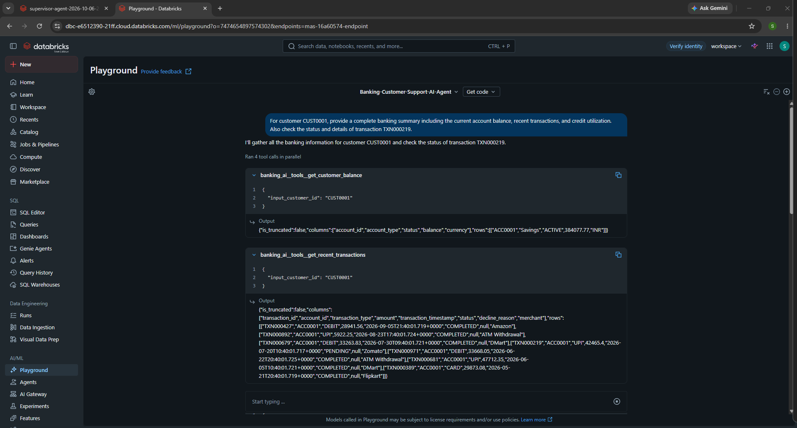
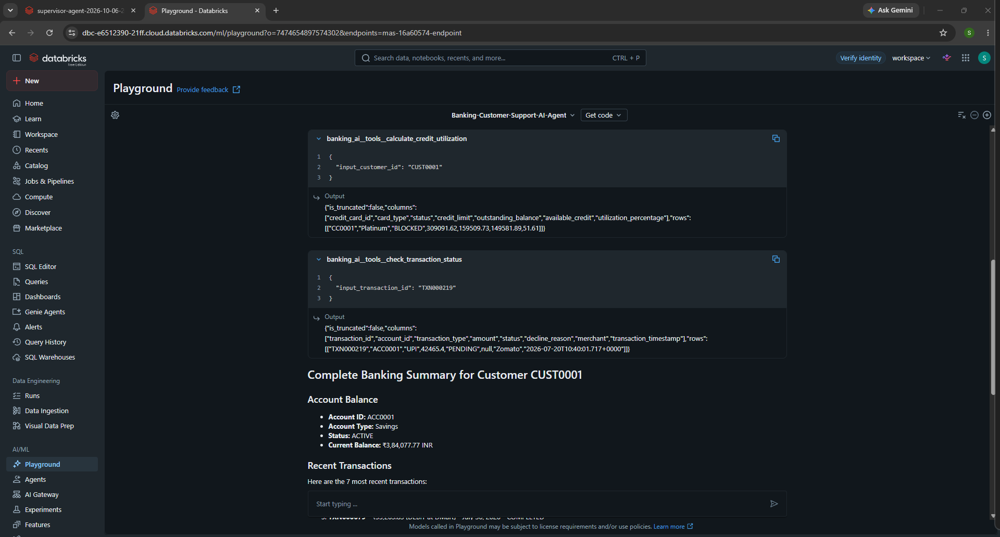
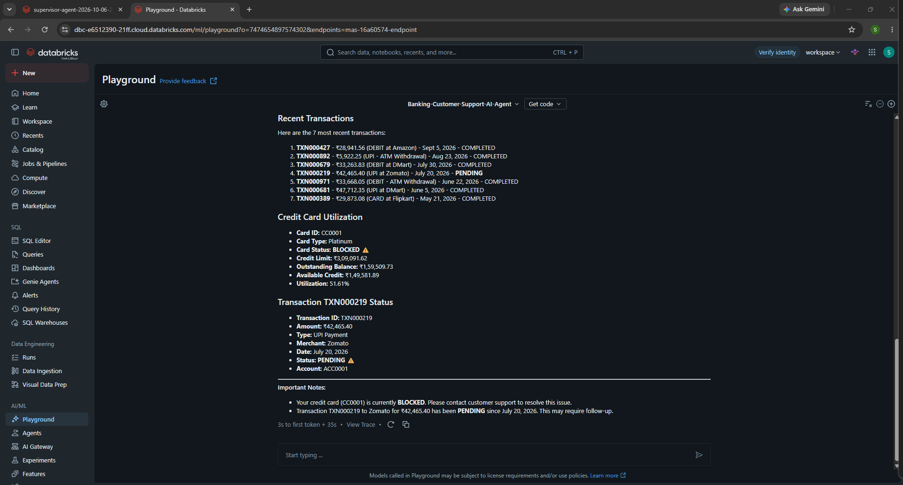

<div align="center">

# 🏦 Agentic Banking Intelligence on Databricks

### A Governed Multi-Tool AI Agent for Banking Customer Support

**Natural Language → Supervisor Agent → Parallel Tool Execution → Unity Catalog → Unified Response**

A production-style Agentic AI system built on the **Databricks Lakehouse Platform** that interprets banking requests, autonomously selects governed tools, executes multiple data operations, and synthesizes the results into a single customer-support response.

<br>


</div>

---

## 🧠 What Makes This an AI Agent?

This project is **not a traditional chatbot** that only generates text.

The banking agent can interpret a natural-language request, determine which tools are required, invoke multiple governed Unity Catalog functions, retrieve structured banking data, and combine the tool outputs into one contextual response.

For a single customer request, the agent can autonomously:

- retrieve the customer's account balance
- fetch recent transactions
- calculate credit-card utilization
- investigate a specific transaction
- execute independent tools in parallel
- synthesize all results into one banking summary

The LLM acts as the **reasoning and orchestration layer**, while governed Unity Catalog functions act as the agent's tools.

---

# 🏗️ Agent Architecture

```text
┌───────────────────────────────────────────────────────────────┐
│                       CUSTOMER REQUEST                        │
│                                                               │
│  "Give me my banking summary and check transaction status"    │
└──────────────────────────────┬────────────────────────────────┘
                               │
                               ▼
┌───────────────────────────────────────────────────────────────┐
│                    DATABRICKS AI PLAYGROUND                    │
│                                                               │
│                 Natural-Language Interface                    │
└──────────────────────────────┬────────────────────────────────┘
                               │
                               ▼
┌───────────────────────────────────────────────────────────────┐
│                     SUPERVISOR AI AGENT                       │
│                                                               │
│   Understand Request → Plan → Select Tools → Orchestrate      │
└──────────────────────────────┬────────────────────────────────┘
                               │
             ┌─────────────────┼─────────────────┐
             │                 │                 │
             ▼                 ▼                 ▼
┌─────────────────┐  ┌─────────────────┐  ┌─────────────────┐
│ Account Balance │  │ Recent          │  │ Credit Card     │
│ Tool            │  │ Transactions    │  │ Utilization     │
└────────┬────────┘  └────────┬────────┘  └────────┬────────┘
         │                    │                    │
         │                    │          ┌─────────┘
         │                    │          │
         │                    │          ▼
         │                    │  ┌─────────────────┐
         │                    │  │ Transaction     │
         │                    │  │ Status Tool     │
         │                    │  └────────┬────────┘
         │                    │           │
         └────────────────────┼───────────┘
                              │
                              ▼
┌───────────────────────────────────────────────────────────────┐
│                  UNITY CATALOG GOVERNANCE                     │
│                                                               │
│          Governed Functions + Banking Data Access             │
└──────────────────────────────┬────────────────────────────────┘
                               │
                               ▼
┌───────────────────────────────────────────────────────────────┐
│                    BANKING DATA LAYER                         │
│                                                               │
│      Customers • Accounts • Transactions • Credit Cards       │
└──────────────────────────────┬────────────────────────────────┘
                               │
                               ▼
┌───────────────────────────────────────────────────────────────┐
│                  AGENT RESPONSE SYNTHESIS                     │
│                                                               │
│       Account + Transactions + Credit + Investigation         │
│                    → Unified Response                         │
└───────────────────────────────────────────────────────────────┘
```

---

# ⚡ Agent Execution Flow

The key engineering feature of this project is **tool orchestration**.

When the user submits a request containing multiple banking requirements, the supervisor agent decomposes the request and determines which tools should be invoked.

```text
User Request
     │
     ▼
Intent Understanding
     │
     ▼
Supervisor Agent
     │
     ├──► get_customer_balance()
     │
     ├──► get_recent_transactions()
     │
     ├──► calculate_credit_utilization()
     │
     └──► check_transaction_status()
                  │
                  ▼
          Structured Tool Results
                  │
                  ▼
          Response Synthesis
                  │
                  ▼
       Customer Banking Summary
```

Independent operations can be executed **in parallel**, reducing unnecessary sequential tool calls and demonstrating agent-based orchestration rather than a fixed query pipeline.

---

# 🛠️ Governed Agent Tools

The agent is equipped with four banking tools implemented as **Databricks Unity Catalog functions**.

| Agent Tool | Responsibility |
|---|---|
| `get_customer_balance` | Retrieves account information and current balance |
| `get_recent_transactions` | Returns recent customer transaction activity |
| `calculate_credit_utilization` | Calculates credit-card usage and available credit |
| `check_transaction_status` | Investigates the status and details of a transaction |

These functions separate **LLM reasoning** from **data retrieval logic**, making the architecture more controlled, modular, and auditable.

---

# 🔐 Why Unity Catalog Functions?

Giving an LLM unrestricted access to banking tables would be a poor architecture.

Instead, the agent interacts with predefined functions exposed through **Unity Catalog**.

```text
LLM / Supervisor Agent
          │
          X  No unrestricted table access
          │
          ▼
Governed Unity Catalog Functions
          │
          ▼
Approved Banking Data Operations
```

This design provides a clearer boundary between the AI reasoning layer and the underlying data layer.

---

# 💬 Example Agent Request

A single natural-language request can require several independent banking operations:

> **For customer CUST0001, provide a complete banking summary including the current account balance, recent transactions, and credit utilization. Also check the status and details of transaction TXN000219.**

Instead of requiring separate queries, the supervisor agent identifies the required tools and orchestrates the workflow automatically.

---

# 🤖 Live Agent Execution

## 1️⃣ Supervisor Agent — Parallel Tool Execution

The agent interprets the request and invokes the required banking tools.



The execution demonstrates that a single natural-language request can trigger multiple independent tool calls.

---

## 2️⃣ Governed Unity Catalog Function Results

The agent retrieves structured information through Unity Catalog tools, including credit utilization and transaction status.



The LLM does not need to manually construct separate banking queries for every user request. It selects the appropriate registered tools based on intent.

---

## 3️⃣ Final Agent-Synthesized Banking Response

After collecting tool results, the agent produces a unified customer-support response.



The final response combines:

**Account Information + Recent Transactions + Credit Utilization + Transaction Investigation**

into one contextual result.

---

# 🧩 End-to-End Agent Lifecycle

```text
1. User submits natural-language banking request
                       ↓
2. Supervisor Agent interprets user intent
                       ↓
3. Agent identifies required banking capabilities
                       ↓
4. Appropriate Unity Catalog tools are selected
                       ↓
5. Independent tools execute in parallel where possible
                       ↓
6. Structured banking results return to the agent
                       ↓
7. Agent reasons across multiple tool outputs
                       ↓
8. Unified customer-support response is generated
```

This architecture demonstrates the transition from a simple **LLM application** to a **tool-using Agentic AI workflow**.

---

# 🗄️ Data & Tool Architecture

The project separates responsibilities across three major layers:

### 🧠 Intelligence Layer
- Databricks Supervisor Agent
- Natural-language understanding
- Tool selection
- Multi-tool orchestration
- Response synthesis

### 🛠️ Governed Tool Layer
- Unity Catalog Functions
- Account balance retrieval
- Transaction retrieval
- Credit utilization calculation
- Transaction-status investigation

### 💾 Banking Data Layer
- Customer records
- Bank accounts
- Transaction history
- Credit-card information

This separation prevents business logic from being embedded entirely inside the LLM prompt.

---

# 🧰 Technology Stack

| Technology | Role |
|---|---|
| **Databricks Lakehouse Platform** | Core data and AI platform |
| **Databricks Supervisor Agent** | Agent orchestration and reasoning |
| **Databricks AI Playground** | Agent interaction and testing |
| **Unity Catalog** | Governed tool registration and access |
| **Unity Catalog Functions** | Banking tools used by the agent |
| **SQL** | Banking data retrieval and business logic |
| **Model Serving** | Model inference layer |
| **GitHub** | Source control and project documentation |

---

# 📁 Repository Structure

```text
databricks-banking-customer-support-ai-agent/
│
├── sql/
│   └── setup_banking_ai.sql
│
├── screenshots/
│   ├── 01-agent-parallel-tool-execution.png
│   ├── 02-unity-catalog-function-results.png
│   └── 03-final-banking-agent-response.png
│
└── README.md
```

### `sql/setup_banking_ai.sql`

Contains the Unity Catalog banking functions used by the supervisor agent for governed data access and tool execution.

### `screenshots/`

Contains execution evidence from Databricks AI Playground showing tool invocation, structured results, and the final agent response.

---

# 🎯 Engineering Decisions

### Tool-based architecture instead of prompt-only AI

Banking operations are exposed as explicit functions rather than relying on the model to generate arbitrary data-access logic.

### Supervisor-driven orchestration

The agent decides which capabilities are required from the user's request instead of following one hard-coded sequence.

### Parallel execution

Independent banking operations can be invoked together, demonstrating multi-tool agent orchestration.

### Separation of reasoning and data access

The model handles intent, planning, and synthesis while Unity Catalog functions handle deterministic data operations.

### Governed interface to banking data

Unity Catalog provides a controlled tool boundary between the AI agent and the underlying data.

---

# 🚀 What This Project Demonstrates

This implementation demonstrates practical concepts used in modern **Agentic AI + Data Engineering** systems:

- tool-using AI agents
- supervisor-agent orchestration
- natural-language-to-tool routing
- parallel tool execution
- governed AI data access
- structured function calling
- multi-source result synthesis
- separation of deterministic data operations from probabilistic LLM reasoning
- Databricks Data + AI integration

---

# 🔮 Potential Production Extensions

The architecture can be extended with:

- customer authentication and authorization
- human-in-the-loop escalation
- agent evaluation and tracing
- conversation history
- fraud-alert tools
- payment-dispute workflows
- loan and EMI assistance
- tool-level permissions
- PII masking
- audit logging and observability
- production monitoring and guardrails

These are intentionally treated as **future extensions**, not features already implemented in this repository.

---

# 📌 Project Scope

This repository is a **portfolio implementation using sample banking data** designed to demonstrate a production-style Agentic AI architecture.

It is not connected to a real banking environment and does not process real customer financial information.

---

<div align="center">

## 👨‍💻 Built by Syed Saud Alam

**Data Engineer | AI Engineer**

Building systems at the intersection of **Data Engineering, Databricks and Agentic AI**.

GitHub: `syedsaud15`  
LinkedIn: `syed-saud-dev`

---

### ⭐ Agentic AI × Data Engineering × Databricks

</div>
